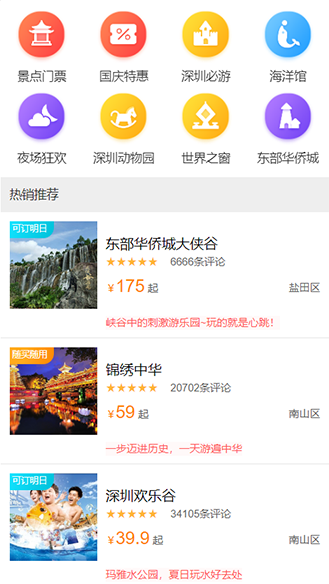
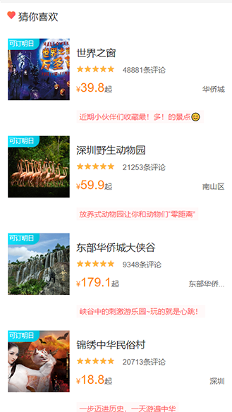
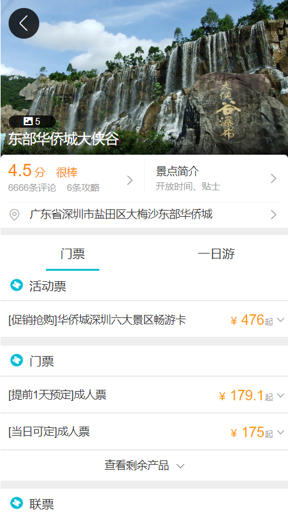
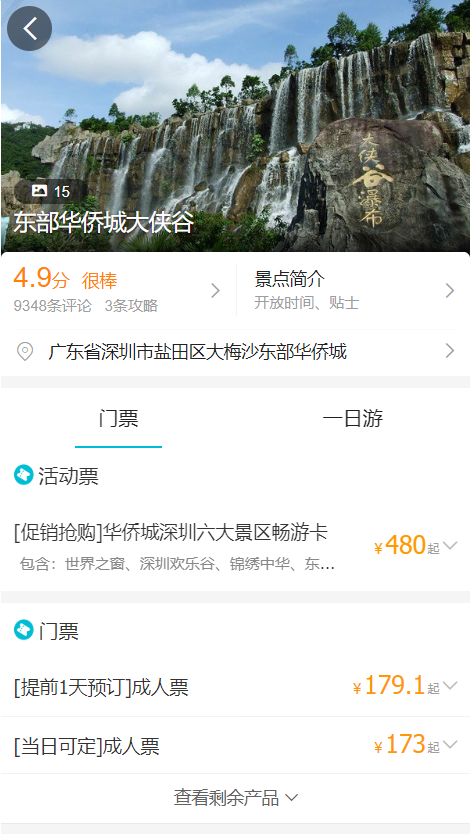

# 仿[去哪儿网](http://piao.qunar.com/touch/)移动端项目

## 技术栈

 项目采用vue+vuex+vue-router+axios将去哪儿网的移动端网站用vue框架做成单页面应用。
 使用koa在后台将json数据传递给前台。

**vue**：将每个页面划分为好几个组件构成，绑定数据模型并动态渲染
页面上的数据，且可以自己构建公共组件库供之后多次复用。

**vuex**：存储所有组件的状态，帮助组件与组件之间的联动。（例如非兄弟组件等不能直接进行数据传递的组件的通信）

**vue-router**：vue官方的路由管理器，可根据开发者所规定的路由条目在页面上进行跳转。

**axios**：在vue2.0中推荐使用的发送ajax请求的插件，请求从后台传来的数据。

## 知识点

[1]使用到了**ES6**的新特性例如扩展运算符(...)、箭头函数、解构赋值、模板字符串等。vue中axios使用了**Promise**发送请求、koa2中使用了**Async函数**来异步请求、传递数据。

[2]使用了shadow、transform、transition等**CSS3**新特性。

[3]使用**webpack**打包项目各种模块。通过配置loader来编译支持其他类型的模块类似postcss、stylus等。配置proxyTable代理服务器以解决开发环境的跨域问题。

## 还原效果
左边的是项目图，右边的是官网图
<table>
<tr>
<td>

<td>

</td>
</tr>

<tr>
<td>

<td>

</tr>

</table>
